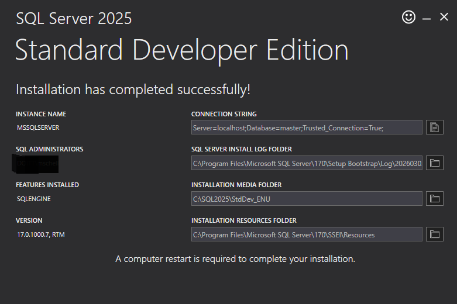

# How Do I SQL Server

Last update March 2026 on a government-issued Windows PC computer.

## Installation on our Government-Issued Windows PC Computers

### Install Microsoft ODBC Driver 18 for SQL Server

[Microsoft says](https://learn.microsoft.com/en-us/sql/connect/odbc/download-odbc-driver-for-sql-server?view=sql-server-ver17) "Version 18.6.1.1 is the latest general availability (GA) version"

[ESRI says](https://pro.arcgis.com/en/pro-app/latest/help/data/databases/database-requirements-sqlserver.htm): "Supported minimum SQL Server 2022 and 2025 — Microsoft ODBC Driver 18.1 for SQL Server"

Go [here](https://docs.microsoft.com/en-us/sql/connect/odbc/download-odbc-driver-for-sql-server) and download _Download Microsoft ODBC Driver 18 for SQL Server (x64)_. Then install.  This will require admin rights.

### Install SQL Server

Prepare for a restart at the end of this step.

1. Go [here](https://www.microsoft.com/en-us/sql-server/sql-server-downloads) and look for  _SQL Server 2025 Developer_. Developer edition does not require a license in non-production environments.

2. Download and install _Standard Developer Edition_  You could consider Enterprise Developer Edition if you know that your target production environment will be Enterprise.

3. After starting the installer choose "Basic" 



### Install SQL Server Management Studio

Prepare for a restart at the end of this step.

SQL Server is too corny to be managed from DBeaver or an SQL prompt.

Go [here](https://docs.microsoft.com/en-us/sql/ssms/download-sql-server-management-studio-ssms?redirectedfrom=MSDN&view=sql-server-ver15) and install _SQL Server Management Studio_. 

### Start The Service

Good luck to you.

Open "SQL Server Configuration Manager". Click on "SQL Server Services." If "SQL Server (MSSQLSERVER)" is running you got lucky.

If you work with a government-issued Windows PC Computer this service is most likely stopped. Try starting it.  

If it won't start try re-opening the "Sql Server Configuration Manager" with administrator rights. Right click "SQL Server (MSSQLSERVER)" and select Properties. Change the "Built-in account" to "Local system" and click apply. Then start "SQL Server (MSSQLSERVER)."

If the service still wont start consult a person or entity who understands Windows.


### sqlcmd: Not great even if you're into this sort of thing

Test like this in a local development setting. This will connect to the default instance MSSQLSERVER on localhost, trusting the certificate chain (-C).  

```bat
C:\Users\jdangermond> rem this is a capital C
C:\Users\jdangermond>sqlcmd -C
1> select 1;
2> go

-----------
          1

(1 rows affected)
```

Use a variable in a script.  Drop a file named whywasthe6scared.sql in Temp with this SQL in it:

```
SELECT CONCAT ( 'because ',  $(Numbertest)) AS haha;
```

```bat
C:\Users\jdangermond>sqlcmd -v NumberTest ="789" -i c:\Temp\whywasthe6scared.sql
haha
--------------------
because 789
```

### Install Another Server

This can be helpful when performing development work, or when you (aka me) forget how to connect to the mess you set up.  For example, you may have set up a server with Windows authentication and would like to try mixed mode.

1. Start - Microsoft SQL Server 2025 - SQL Server 2025 Installation Center
2. Select the installation menu
3. Select New SQL Server stand-alone installation

When prompted for installation media point the thing to something like C:\SQL2025\Developer_ENU.  

## How do I ESRI Enterprise Geodatabase

https://pro.arcgis.com/en/pro-app/latest/help/data/geodatabases/manage-sql-server/setup-geodatabase-sqlserver.htm
